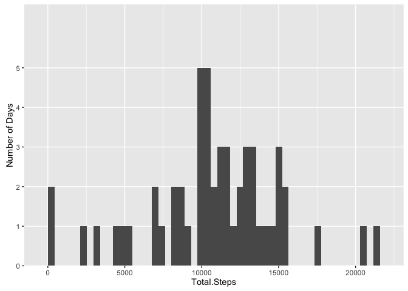
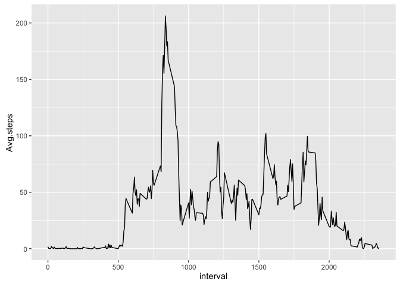
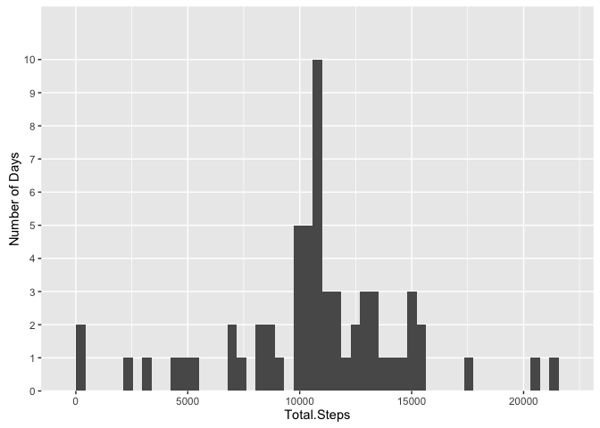
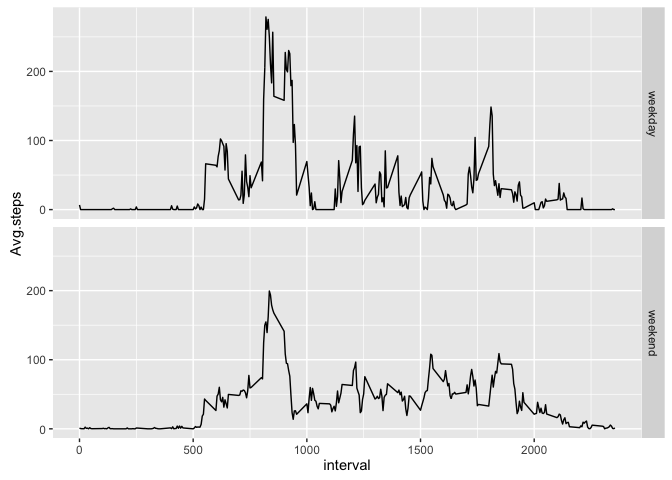

# Reproducible Research: Peer Assessment 1

## Import libraries

```r
library(dplyr)
library(ggplot2)
library(lubridate)
library(stringr)
```

## Loading and preprocessing the data

```r
# Read csv file and add factor for weekday/weekend. Convert steps to numeric.
DAT.FULL <- read.csv("activity.csv", stringsAsFactors = FALSE) %>%
        mutate(day_type = as.factor(ifelse(day(date) < 6, "weekday", "weekend")),
               steps = as.numeric(steps))
# Make a copy with NA values removed
DAT <- na.omit(DAT.FULL)
```


## What is mean total number of steps taken per day?
**Histogram of total number of step taken per day**

```r
steps_per_day = DAT %>% group_by(date) %>% summarize(Total.Steps = sum(steps), Median=median(steps), Mean=mean(steps))

ggplot(data = steps_per_day, aes(x=Total.Steps)) + geom_histogram(bins=50) + scale_y_discrete("Number of Days")
```

\

**Total, median, and mean steps taken per day**

```r
print(tbl_df(steps_per_day), n=100)
```

```
## Source: local data frame [53 x 4]
## 
##          date Total.Steps Median       Mean
##         (chr)       (dbl)  (dbl)      (dbl)
## 1  2012-10-02         126      0  0.4375000
## 2  2012-10-03       11352      0 39.4166667
## 3  2012-10-04       12116      0 42.0694444
## 4  2012-10-05       13294      0 46.1597222
## 5  2012-10-06       15420      0 53.5416667
## 6  2012-10-07       11015      0 38.2465278
## 7  2012-10-09       12811      0 44.4826389
## 8  2012-10-10        9900      0 34.3750000
## 9  2012-10-11       10304      0 35.7777778
## 10 2012-10-12       17382      0 60.3541667
## 11 2012-10-13       12426      0 43.1458333
## 12 2012-10-14       15098      0 52.4236111
## 13 2012-10-15       10139      0 35.2048611
## 14 2012-10-16       15084      0 52.3750000
## 15 2012-10-17       13452      0 46.7083333
## 16 2012-10-18       10056      0 34.9166667
## 17 2012-10-19       11829      0 41.0729167
## 18 2012-10-20       10395      0 36.0937500
## 19 2012-10-21        8821      0 30.6284722
## 20 2012-10-22       13460      0 46.7361111
## 21 2012-10-23        8918      0 30.9652778
## 22 2012-10-24        8355      0 29.0104167
## 23 2012-10-25        2492      0  8.6527778
## 24 2012-10-26        6778      0 23.5347222
## 25 2012-10-27       10119      0 35.1354167
## 26 2012-10-28       11458      0 39.7847222
## 27 2012-10-29        5018      0 17.4236111
## 28 2012-10-30        9819      0 34.0937500
## 29 2012-10-31       15414      0 53.5208333
## 30 2012-11-02       10600      0 36.8055556
## 31 2012-11-03       10571      0 36.7048611
## 32 2012-11-05       10439      0 36.2465278
## 33 2012-11-06        8334      0 28.9375000
## 34 2012-11-07       12883      0 44.7326389
## 35 2012-11-08        3219      0 11.1770833
## 36 2012-11-11       12608      0 43.7777778
## 37 2012-11-12       10765      0 37.3784722
## 38 2012-11-13        7336      0 25.4722222
## 39 2012-11-15          41      0  0.1423611
## 40 2012-11-16        5441      0 18.8923611
## 41 2012-11-17       14339      0 49.7881944
## 42 2012-11-18       15110      0 52.4652778
## 43 2012-11-19        8841      0 30.6979167
## 44 2012-11-20        4472      0 15.5277778
## 45 2012-11-21       12787      0 44.3993056
## 46 2012-11-22       20427      0 70.9270833
## 47 2012-11-23       21194      0 73.5902778
## 48 2012-11-24       14478      0 50.2708333
## 49 2012-11-25       11834      0 41.0902778
## 50 2012-11-26       11162      0 38.7569444
## 51 2012-11-27       13646      0 47.3819444
## 52 2012-11-28       10183      0 35.3576389
## 53 2012-11-29        7047      0 24.4687500
```

## What is the average daily activity pattern?
**Average steps by Interval**

```r
plot_dat <- DAT %>% group_by(interval) %>% summarize(Avg.steps=mean(steps))
ggplot(plot_dat, aes(x=interval, y=Avg.steps)) + geom_line()
```

\
**Highest interval**

```r
plot_dat %>% arrange(desc(Avg.steps)) %>% head(n=1)
```

```
## Source: local data frame [1 x 2]
## 
##   interval Avg.steps
##      (int)     (dbl)
## 1      835  206.1698
```

## Inputing missing values
**Number of missing values**

```r
sum(is.na(DAT.FULL))
```

```
## [1] 2304
```

**Fill in missing values**

```r
# Compute average steps for the given interval, ignoring NA values
avg.steps <- function(myInterval) { 
        mean(na.omit(filter(DAT.FULL, interval==myInterval)$steps))
}
# Fill in NA values with average value
DAT.ENRICHED <- DAT.FULL %>% mutate(steps = ifelse(is.na(steps), avg.steps(interval), steps))
```

**Histogram of total number of step taken per day**

```r
steps_per_day = DAT.ENRICHED %>% group_by(date) %>% summarize(Total.Steps = sum(steps), Median=median(steps), Mean=mean(steps))

ggplot(data = steps_per_day, aes(x=Total.Steps)) + geom_histogram(bins=50) + scale_y_discrete("Number of Days")
```

\

**Total, median, and mean steps taken per day**

```r
print(tbl_df(steps_per_day), n=100)
```

```
## Source: local data frame [61 x 4]
## 
##          date Total.Steps  Median       Mean
##         (chr)       (dbl)   (dbl)      (dbl)
## 1  2012-10-01    10766.19 37.3826 37.3825996
## 2  2012-10-02      126.00  0.0000  0.4375000
## 3  2012-10-03    11352.00  0.0000 39.4166667
## 4  2012-10-04    12116.00  0.0000 42.0694444
## 5  2012-10-05    13294.00  0.0000 46.1597222
## 6  2012-10-06    15420.00  0.0000 53.5416667
## 7  2012-10-07    11015.00  0.0000 38.2465278
## 8  2012-10-08    10766.19 37.3826 37.3825996
## 9  2012-10-09    12811.00  0.0000 44.4826389
## 10 2012-10-10     9900.00  0.0000 34.3750000
## 11 2012-10-11    10304.00  0.0000 35.7777778
## 12 2012-10-12    17382.00  0.0000 60.3541667
## 13 2012-10-13    12426.00  0.0000 43.1458333
## 14 2012-10-14    15098.00  0.0000 52.4236111
## 15 2012-10-15    10139.00  0.0000 35.2048611
## 16 2012-10-16    15084.00  0.0000 52.3750000
## 17 2012-10-17    13452.00  0.0000 46.7083333
## 18 2012-10-18    10056.00  0.0000 34.9166667
## 19 2012-10-19    11829.00  0.0000 41.0729167
## 20 2012-10-20    10395.00  0.0000 36.0937500
## 21 2012-10-21     8821.00  0.0000 30.6284722
## 22 2012-10-22    13460.00  0.0000 46.7361111
## 23 2012-10-23     8918.00  0.0000 30.9652778
## 24 2012-10-24     8355.00  0.0000 29.0104167
## 25 2012-10-25     2492.00  0.0000  8.6527778
## 26 2012-10-26     6778.00  0.0000 23.5347222
## 27 2012-10-27    10119.00  0.0000 35.1354167
## 28 2012-10-28    11458.00  0.0000 39.7847222
## 29 2012-10-29     5018.00  0.0000 17.4236111
## 30 2012-10-30     9819.00  0.0000 34.0937500
## 31 2012-10-31    15414.00  0.0000 53.5208333
## 32 2012-11-01    10766.19 37.3826 37.3825996
## 33 2012-11-02    10600.00  0.0000 36.8055556
## 34 2012-11-03    10571.00  0.0000 36.7048611
## 35 2012-11-04    10766.19 37.3826 37.3825996
## 36 2012-11-05    10439.00  0.0000 36.2465278
## 37 2012-11-06     8334.00  0.0000 28.9375000
## 38 2012-11-07    12883.00  0.0000 44.7326389
## 39 2012-11-08     3219.00  0.0000 11.1770833
## 40 2012-11-09    10766.19 37.3826 37.3825996
## 41 2012-11-10    10766.19 37.3826 37.3825996
## 42 2012-11-11    12608.00  0.0000 43.7777778
## 43 2012-11-12    10765.00  0.0000 37.3784722
## 44 2012-11-13     7336.00  0.0000 25.4722222
## 45 2012-11-14    10766.19 37.3826 37.3825996
## 46 2012-11-15       41.00  0.0000  0.1423611
## 47 2012-11-16     5441.00  0.0000 18.8923611
## 48 2012-11-17    14339.00  0.0000 49.7881944
## 49 2012-11-18    15110.00  0.0000 52.4652778
## 50 2012-11-19     8841.00  0.0000 30.6979167
## 51 2012-11-20     4472.00  0.0000 15.5277778
## 52 2012-11-21    12787.00  0.0000 44.3993056
## 53 2012-11-22    20427.00  0.0000 70.9270833
## 54 2012-11-23    21194.00  0.0000 73.5902778
## 55 2012-11-24    14478.00  0.0000 50.2708333
## 56 2012-11-25    11834.00  0.0000 41.0902778
## 57 2012-11-26    11162.00  0.0000 38.7569444
## 58 2012-11-27    13646.00  0.0000 47.3819444
## 59 2012-11-28    10183.00  0.0000 35.3576389
## 60 2012-11-29     7047.00  0.0000 24.4687500
## 61 2012-11-30    10766.19 37.3826 37.3825996
```

### Comparison of enriched data set to unenriched
**Q:** Do these values differ from the estimates from the first part of the assignment?

**A:** Yes, the histogram has changed, and several days have different median and mean values.

**Q:** What is the impact of imputing missing data on the estimates of the total daily number of steps?

**A:** In general the number of total daily steps increases on days where steps values were NA.

## Are there differences in activity patterns between weekdays and weekends?
**Comparison of weekday vs weekend**

```r
plot_dat <- DAT %>% group_by(interval, day_type) %>% summarize(Avg.steps=mean(steps))
ggplot(plot_dat, aes(x=interval, y=Avg.steps)) + geom_line() + facet_grid(day_type ~ .)
```

\
